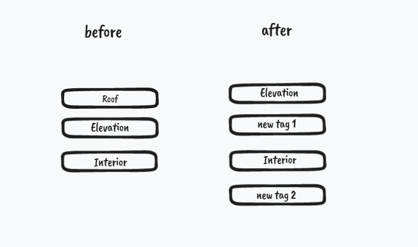
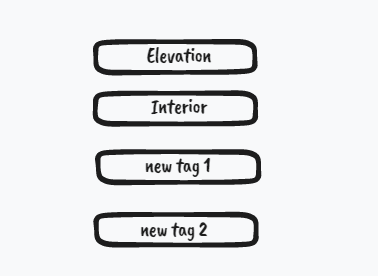
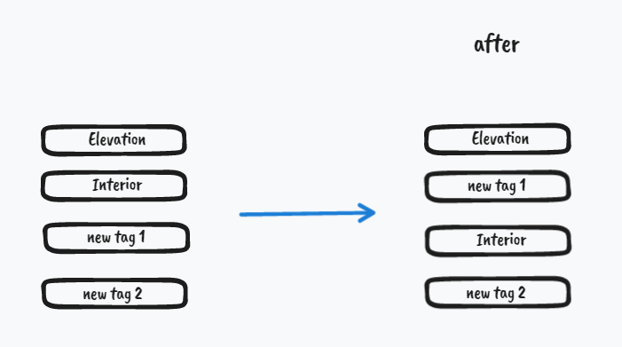
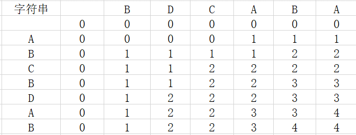
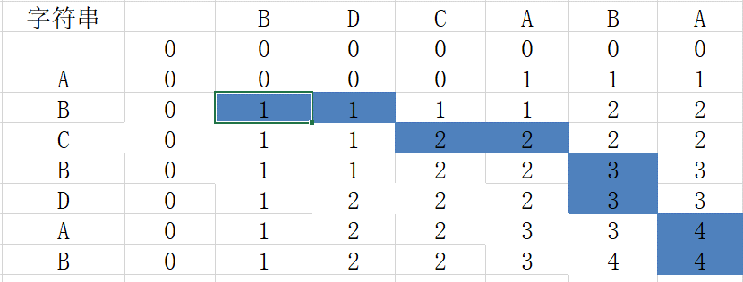

## 目录

*   [最小操作量算法-排序](#最小操作量算法-排序)

    *   *   *   [业务场景](#业务场景)

            *   [介绍](#介绍)

        *   [算法核心](#算法核心)

            *   [最长公共子序列（LCS）](#最长公共子序列lcs)

            *   [找到LCS-回溯](#找到lcs-回溯)

        *   [业务场景](#业务场景-1)

            *   [找到增删项](#找到增删项)

            *   [列表替换](#列表替换)

            *   [最少次数排序](#最少次数排序)

            *   [业务定制](#业务定制)

# 最小操作量算法-排序

#### 业务场景

该算法适用于这样的业务场景：

*   前端需要对列表操作，后台没有提供批量操作的接口，而是提供了针对单项的增删改排的原子接口。

*   前端为了提高用户体验，即不期望进行实时请求，因为每一个操作都去调取后台接口，效率是很低的。

#### 介绍

以一般的tag编辑功能为例，我们采取的处理方法是：列表改动时，对本地数据直接操作，而将后台操作存到任务队列中，最后统一按序请求。

但是，用户可能做的操作仅仅是排序过去，又排序回来，或者给tag更名，又改回来，这种情况最好是不需要发送请求的；又或者用户给一个tag连续更名3次，我们应该只发送最后一次更名的请求。所以，我们最好设计一个算法，对比一开始的列表和所有操作完毕后的列表，使用最少次数的请求完成这个变换。

例如：



1.  先遍历，找到删除的项和新增的项，**添加对应的任务到队列**。

    删除：Roof，添加：new tag 1、new tag 2

    有没有发现，这个过程就自然过滤了用户无意义操作，比如new tag 1以前可能一开始叫tag1，然后改成了new tag 1，但是这个过程我们无需关注和知晓。

2.  上面的操作结束后（此时如果有新增项，应该调一波后台接口，同步本地数据，否则后续对新增项的排序请求将找不到目标），此时的tags列表会变成：

    

3.  现在只要将这个列表**排序**成after对应的列表即可：

    

后端提供的排序接口是：将目标项排到某一项的后面。

排序的方法我研究了一下，发现按下面这样操作是最高效的：

1.  找到两个列表的**最长公共子序列(LCS)**：`[Elevation, Interior, new tag2]`或者\[`Elevation, new tag1, new tag2`]（这部分即为不需要调整的部分）

2.  **从前往后扫描after列表**，对于不属于LCS(以第一个为例)的项，根据当前位置进行排序：

    1.  扫描到new tag 1，直接看在after列表的哪个tag后面：`Elevation`，然后将把new tag 1排序到Elevation后的请求保存到任务队列。

那为什么仅用after列表和LCS就能保证一次遍历操作就得到正确结果？

*   首先：我们操作的是不属于最长公共子序列的项，也就是必须作出排序操作才能得到正确结果的项，所以不可能操作到一个不需要改变位置(或者说通过其他的项改变位置来让该项满足条件，那该项就应该属于**最长公共子序列**)

*   其次，我们从前往后扫描，那就确保了前面的项一定是经过了处理满足了after列表位置要求的项，所以直接将当前项排到前一项后面是没有问题的。

> 当然，如果你的排序要求是将目标项排到某一项的前面，就要从后往前扫描了，至于为什么，可以思考一下。

### 算法核心

#### 最长公共子序列（LCS）

leetcode上的题目要求是找到LCS的长度，参见：[**https://leetcode.cn/problems/longest-common-subsequence/submissions/**](https://leetcode.cn/problems/longest-common-subsequence/submissions/ "https://leetcode.cn/problems/longest-common-subsequence/submissions/")

```javascript
function LCS_DP(originList, targetList) {
  const len1 = originList.length, len2 = targetList.length;
  const dp = new Array(len1).fill(0).map(v => new Array(len2).fill(0));
  if (originList[0] === targetList[0]) dp[0][0] = 1;
  for (let i = 1; i < len1; i++) {
      dp[i][0] = originList[i] === targetList[0] ? 1 : dp[i - 1][0];
  }
  for (let j = 1; j < len2; j++) {
      dp[0][j] = originList[0] === targetList[j] ? 1 : dp[0][j - 1];
  }

  for (let i = 1; i < len1; i++) {
      for (let j = 1; j < len2; j++) {
          dp[i][j] = originList[i] === targetList[j] ? dp[i - 1][j - 1] + 1 : Math.max(dp[i - 1][j], dp[i][j - 1]);
      }
  }
  return dp;
}
```

#### 找到LCS-回溯

参考文档：[**最长公共子序列(LCS)**](https://blog.csdn.net/ten_sory/article/details/79798064?spm=1001.2101.3001.6650.7\&utm_medium=distribute.pc_relevant.none-task-blog-2%7Edefault%7EBlogCommendFromBaidu%7ERate-7-79798064-blog-51534607.pc_relevant_3mothn_strategy_and_data_recovery\&depth_1-utm_source=distribute.pc_relevant.none-task-blog-2%7Edefault%7EBlogCommendFromBaidu%7ERate-7-79798064-blog-51534607.pc_relevant_3mothn_strategy_and_data_recovery\&utm_relevant_index=13 "最长公共子序列(LCS)")

找到最长公共子序列的长度比较容易，但是我们要获取到这个序列。而实际可能序列不唯一，我们获取其中一个即可。以序列：**B**D**C**A**BA**和A**BCB**D**A**B为例：



表格右下角的值为LCS\[x]\[y] = 4， 我们需要考虑的是4是怎么计算出来的，反推数字4的来历，记录这个路径，就可以找规律求出其中一个LCS了。

对于(i, j)位置，

如果A\[i]==B\[j]，那么左上方向的数据+1，填到(i, j)位置

否则左边和上边两个方向的最大值，填到(i, j)位置

对于(i, j) = (7, 6)，即最右下角，A\[7]!=B\[6]，所以看LCS\[6]\[6]和LCS\[7]\[5]，这两个值都是4，我们取其中一个即可，比如规定一样时**取上方的字符串**(这样是第一个串靠前的部分先被匹配)。

那么这个长度为4的LCS得到的过程如下图所示：



代码的思路就很简单了：首先创建结果数组resArr = \[]；

1.  从右下角遍历，如果A\[i] === B\[j]，resArr.unshift(A\[i])；i--；j--，继续执行这一步；

2.  否则看LCS\[i-1]\[j]和LCS\[i]\[j-1]，谁大就移动到对应的位置（令i--或者j--），考虑边界：如果某边已达边界，就移动到另一边，重复执行1、2步；

3.  上面步骤中，LCS\[i]\[j]为0或i/j已超边界就结束操作；

4.  最后return resArr；即为正序的最长公共子序列。

代码如下：

```javascript
function getLCS(originList, targetList) {
  const DP = LCS_DP(originList, targetList);
  const resArr = [];
  let i = originList.length - 1, j = targetList.length - 1;
  while(DP[i][j] > 0) {
    if (originList[i] === targetList[j]) {
      resArr.unshift(targetList[j]);
      i--; j--;
      if (i < 0 || j < 0) break;
    } else if (i === 0) {
      j--;
    } else if (j === 0) {
      i--;
    } else {
      if (DP[i - 1][j] >= DP[i][j - 1]) i--;
      else j--;
    }
  }
  return resArr;
}
```

### 业务场景

#### 找到增删项

实际的业务场景中，我们在找到LCS之前，要先找到新增或被删的元素，上面的示例中同一字母/字符串的项都有可替代性。但是在实际的业务场景中，一般传入的list中每个元素都是不可替代的（一般为对象）。

```javascript
const delList = originList.filter(v => !targetList.includes(v));
const appendList = targetList.filter(v => !originList.includes(v));
```

然后记录**操作步骤**：

```javascript
const operation = [];

operation.push(...delList.map(v => ({ del: v })));
operation.push(...appendList.map(v => ({ add: v })));

```

**操作说明**：operation中的每一项代表一个操作

*   { del: item }：删除item

*   { add: item }：添加item

*   { from: item1, to: item2 }：将item1排到item2后面

#### 列表替换

将旧列表变为执行了增删操作之后的列表：

```javascript
const beforeSortList = originList.filter(v => !delList.includes(v)).concat(appendList)
```

这样接下来就只需要进行排序操作了。

#### 最少次数排序

这时就需要用到找到LCS的算法了，我们根据上面的beforeSortList和targetList两个列表得到LCS，然后就能通过这个LCS和targetList得到最少的操作次数了！甚至不需要传入排序之前的列表(beforeSortList)。

流程如下：

```javascript
const LCS = getLCS(beforeSortList, targetList);

operation.push(...sortOperation(targetList, LCS));

```

具体的排序操作如下：

```javascript
function sortOperation(targetList, LCS) {
  const operation = []
  for (let i = 0, len = targetList.length; i < len; i++) {
    if (!LCS.includes(targetList[i])) {
      operation.push({ sort: { from: targetList[i], to: i > 0 ? targetList[i - 1] : null } });
    }
  }
  return operation;
}
```

**汇总**：将上面的过程汇总起来，封装到minOperation函数中：

```javascript
function minOperation(originList, targetList) {
  const delList = originList.filter(v => !targetList.includes(v));
  const appendList = targetList.filter(v => !originList.includes(v));

  const operation = [];

  operation.push(...delList.map(v => ({ del: v })));
  operation.push(...appendList.map(v => ({ add: v })));

  const beforeSortList = originList.filter(v => !delList.includes(v)).concat(appendList);

  const LCS = getLCS(beforeSortList, targetList);
  
  operation.push(...sortOperation(targetList, LCS));

  return operation;
}
```

当然还可能出现已有tag更名的操作，只要对比beforeSortList和targetList中共同项的名字是否一样就行了。（所以不要一开始给originList和targetList传同一个对象的引用，除非你只进行排序操作；否则假如你更改了名字等信息，是两边一起变的）

测试一下：

```javascript
const result = MinOperation([1, 2, 3, 4, 5, 6], [3, 5, 6, 4, 2, 1]);
// 可以看出上述算法得出的最长公共子串: 3 5 6
result // [[4, 6],[2, 4],[1, 2]]       即:将4放到6后, 将2放到4后, 将1放到2后
```

#### 业务定制

我们将该算法与业务场景结合时，可能要变更下用作**对比的值**，由于原题每一项都是字符串，所以是直接对比的字符是否相等，但实际业务中可能是对比每一项的id等唯一标识。所以可以传入一个`identify`函数参数，即自定义对比方法，将上面所有用到全等判断的地方和`Aarry.prototype.includes`的地方都用这个`identify`替换，但是由于不是核心逻辑，这里就不把代码写复杂了。
